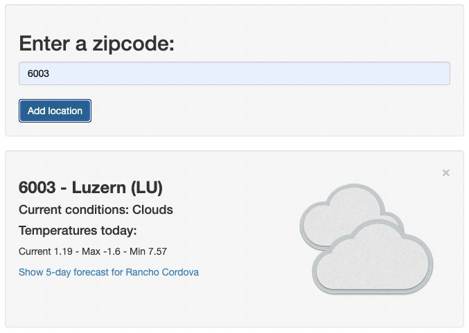
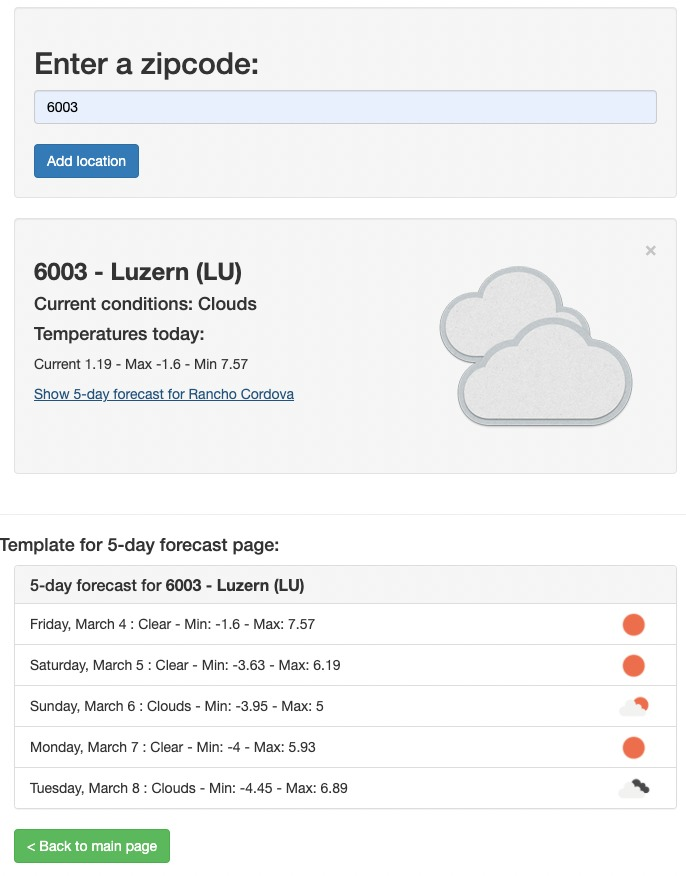

# Weather Application
This project based on was Angular 13.0.2 / AngularCLI. <br>
This Angular application will allow you to fetch the details from the openweathermap and gives five day forecast and current weather by the zip code. In this project, [OpenWeather API](https://openweathermap.org/api) and [GeoAdmin API](https://api3.geo.admin.ch/index.html) free APIs are used. <br>

OpenWeather API provides many services most of them require subscription. The most convenient for our app is One Call API. One Call API expects a city's geo location in order to gives weather forecast. At this point, GeoAdmin API was used to convert the geolocation of the zipcode received from the user.<br><br>


<figure align="center">
<figcaption font-size="90">CURRENT WEATHER </figcaption><br>
<kbd>
  
  </kbd>
</figure><br><br>

*********************************************************************
<figure align="center">
<figcaption>5 DAY WEATHER FORECAST</figcaption>
<kbd>
  
   </kbd>
</figure><br><br>


## Overview of Applications
- [Live Demo](#Live-Demo)
- [Build with](#Build-with)
- [GeoAdmin API](#Usage-of-the-GeoAdmin-API)
- [OpenWeather API](#Usage-of-the-One-Call-API)


## Live Demo
Here is a working live demo:[demo](https://lwairore.github.io/angular-weather-app/)

## Development server

Run `ng serve` for a dev server. Navigate to `http://localhost:4200/`. The app will automatically reload if you change any of the source files.

## Code scaffolding

Run `ng generate component component-name` to generate a new component. You can also use `ng generate directive|pipe|service|class|guard|interface|enum|module`.

## Build with
- [Angular](https://angular.io/) - An Application Design Framework and Development Platform for creating efficient and sophisticated single-page apps.
- [Boostrap](https://getbootstrap.com/) - The world’s most popular framework for building responsive, mobile-first sites, with jsDelivr and a template starter page.
- [OpenWeather API](https://openweathermap.org/api) - Fast and easy-to-work weather APIs.
- [Geocoding API](https://api3.geo.admin.ch/index.html) - Convert between zipcode and geographic coordinates.
- [RxJS](https://rxjs.dev/) - A javascript library for reactive programming using Observables, to make it easier to compose asynchronous or callback-based code.
- [TypeScript](https://www.typescriptlang.org/) - TypeScript is an open-source language which builds on JavaScript, one of the world’s most used tools, by adding static type definitions.
ng-connection-service - Detects whether browser has an active internet connection or not in Angular application.

## Running unit tests

Run `ng test` to execute the unit tests via [Karma](https://karma-runner.github.io).

## Running end-to-end tests

Run `ng e2e` to execute the end-to-end tests via a platform of your choice. To use this command, you need to first add a package that implements end-to-end testing capabilities.

## Further help

To get more help on the Angular CLI use `ng help` or go check out the [Angular CLI Overview and Command Reference](https://angular.io/cli) page.


## Usage of the GeoAdmin API

The search service is separated in 3 various categories or types:
- The location search which is composed of the following geocoded locations:
    + Cantons, Cities and communes
    + All names as printed on the national map [SwissNames](https://shop.swisstopo.admin.ch/de/products/free_geodata)
    + The districts
    + The ZIP codes
    + The addresses
    + The cadastral parcels
- The layer search wich enables the search of layers belonging to the GeoAdmin API.
- The feature search which is used to search through features descriptions. Note: you can also specify a bounding box to filter the features. [Searchable layers](https://api3.geo.admin.ch/api/faq/index.html#which-layers-are-searchable)


API call:

```
https://api3.geo.admin.ch/rest/services/api/SearchServer?searchText={zipcode}

```
A sample response
```json
  {
    "results": [
        {
            "id": 3156,
            "weight": 100,
            "attrs": {
                "origin": "zipcode",
                "geom_quadindex": "03002223",
                "zoomlevel": 4294967295,
                "featureId": "364A9306-A661-4AC9-B68E-36058214378C",
                "lon": 8.309197425842285,
                "detail": "6003",
                "rank": 1,
                "geom_st_box2d": "BOX(663824.177 210286.775999997,666430.104 212433.883000001)",
                "lat": 47.05450439453125,
                "num": 1,
                "y": 666143.75,
                "x": 211864.1875,
                "label": "<b>6003 - Luzern (LU)</b>"
            }
        }
    ]
}
```


## Usage of the OpenWeather API

>**`OpenWeather` is a weather website that provides its own free API for people to use. It is handy for building small weather apps for our own use. In this application, [One Call API](https://openweathermap.org/api/one-call-api) service offered by OpenWeather API is used.**

- The One Call API provides the following weather data for any geographical coordinates:

    + Current weather
    + Minute forecast for 1 hour
    + Hourly forecast for 48 hours
    + Daily forecast for 7 days
    + National weather alerts
    + Historical weather data for the previous 5 days


API call 

```
https://api.openweathermap.org/data/2.5/onecall?lat={lat}&lon={lon}&exclude={part}&appid={API key}

```

A sample response

```json
{
          "lat": 47.0545,
          "lon": 8.3092,
          "current": {
            "temp": 1.44,
            "feels_like": 1.44,
            "weather": [
              {
                "id": 800,
                "main": "Clear",
                "description": "clear sky",
                "icon": "01n",
              },
            ],
          },
          "daily": [
            {
              "dt": 1646305200,
              "temp": {
                "day": 9.93,
                "min": -0.1,
                "max": 10.56,
              },
              "weather": [
                {
                  "id": 800,
                  "main": "Clear",
                  "description": "clear sky",
                  "icon": "01d",
                }
              ]
            }
          ]
        }
                              
```

## License

[MIT](https://choosealicense.com/licenses/mit/)
